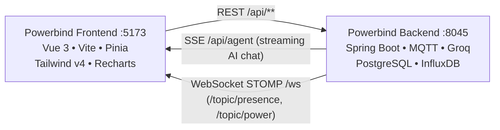

# Powerbind — Frontend

Vue 3 single-page app for the **Powerbind** IoT smart-home energy management system: a live monitoring dashboard and an integrated multimodal AI energy advisor.
Built with **Vue 3 + Vite + Tailwind CSS v4 + Pinia**.

---

## What is this frontend for?

The frontend is the user-facing side of Powerbind. It talks to the Spring Boot backend (default `http://localhost:8045`) over REST, Server-Sent Events, and WebSocket STOMP.

| Page | What it does |
|---|---|
| **Login** (`/login`) | JWT sign-in. Tokens are kept in `localStorage`; any API `401` clears the session and redirects back here |
| **Dashboard** (`/`) | Live home overview: current power (W), energy (kWh), cost, per-room cards with presence and relay state, 24 h power history chart, energy donut. Weather-aware theming |
| **Agent** (`/agent`) | Streaming AI energy advisor: text chat, image queries (vision), document Q&A (PDF/DOCX/TXT), voice input (Whisper), and per-user conversation history with markdown + Mermaid rendering |
| **ERD** (`/erd`) | Admin-only entity-relationship viewer: tables, columns (PK/FK) and relations rendered from the backend's live JPA entities, with pan/zoom/drag layout and relation highlighting |
| **Logs** (`/log`) | Admin-only system log viewer: merged Backend / Frontend / IoT streams from Loki, filterable by level, text, and time range, polling live every 3 s |



---

## Tech stack

- **Core:** Vue 3 (Composition API, `<script setup>`), Vite, Vue Router, Pinia
- **Styling:** Tailwind CSS v4, lucide-vue-next icons, custom canvas/chart components (Recharts)
- **Communication:** axios (JWT interceptor), @stomp/stompjs + sockjs-client (live updates), fetch + SSE (streaming AI chat)
- **AI chat UI:** marked (GFM markdown), mermaid (diagrams), DOMPurify
- **Quality:** ESLint + oxlint + oxfmt

---

## Getting the repo (clone / pull)

```bash
# First time — clone
git clone https://github.com/nxstray/powerbind-frontend.git
cd powerbind-frontend

# Later — get the latest changes
git pull origin main
```

---

## Prerequisites

| Tool | Version | Needed for |
|---|---|---|
| Node.js | ^22.18.0 or >= 24.12.0 | building/running (see `engines` in `package.json`) |
| npm | 10+ (bundled with Node) | package management |
| Powerbind backend | running (default `http://localhost:8045`) | all data and AI features — see the backend README |

---

## Configuration (`.env`)

The only variable is the backend base URL. It is optional — it defaults to `http://localhost:8045`.

```bash
# frontend/.env  (optional)
VITE_API_URL=http://localhost:8045
```

| Variable | Required | Default | Description |
|---|---|---|---|
| `VITE_API_URL` | no | `http://localhost:8045` | Backend base URL used for REST (`/api/**`), SSE streaming, and the SockJS WebSocket endpoint (`{VITE_API_URL}/ws`) |

After changing `.env`, restart the dev server for it to take effect.

---

## How to run

```bash
# 1. Install dependencies
npm install

# 2. Start the backend first (see the backend README), then:
npm run dev
```

Open **http://localhost:5173**.

| Command | What it does |
|---|---|
| `npm run dev` | Dev server with hot reload at `http://localhost:5173` |
| `npm run build` | Production build into `dist/` |
| `npm run preview` | Serve the production build locally |
| `npm run lint` | Lint and auto-fix with oxlint + ESLint |
| `npm run format` | Format `src/` with oxfmt |

---

## User guide

### 1. Sign in

- Open `http://localhost:5173` — you are redirected to `/login` when not authenticated.
- Enter your **username** and **password**, then press **Sign in**.
- Accounts are managed by the backend (user seeding — see the backend README).
- The backend rate-limits requests (30 per 60 s) and locks login after 5 failed attempts for 10 minutes; a `429` shows as "Too many attempts".

### 2. Dashboard

- **Top stats:** current power (W), energy (kWh), estimated cost, occupied rooms, active devices.
- **Room cards:** live presence and relay state per room, updated in real time over WebSocket (no refresh needed).
- **Power chart:** 24 h power history with a selectable time window.
- **Energy donut:** kWh distribution.
- **Smart theming:** accent/background adapts to the current weather (clear, cloudy, night, rain) fetched from the backend.

### 3. AI agent

- Type a question (e.g. "How much energy did the living room use today?") and press **Enter** or the send button. Answers stream in live via Server-Sent Events and render as markdown, including Mermaid diagrams and tables.
- **Attach a file** (paperclip icon):
  - Image → the agent answers with vision.
  - PDF / DOCX / TXT → the agent answers questions about the document.
  - A preview chip appears above the input; press the X to remove the attachment before sending.
- **Voice input** (microphone icon): press to record, press again to stop — the recording is transcribed by Whisper on the backend and filled into the input. Browser microphone permission is required.
- **Conversation history** (top bar):
  - **Riwayat Chat** dropdown lists past threads, most recent first; click one to load it.
  - **New chat** starts a fresh thread.
  - Click the conversation title to **rename** it inline (Enter to save, Esc to cancel).
  - Conversations can be deleted from the history list. All history is strictly per-user.
- The active conversation is remembered across page reloads.

### 4. ERD (admin only)

- The **ERD** sidebar item appears only when the signed-in account has the `ADMIN` role.
- Renders tables, columns (key/link icons mark PK/FK) and relations straight from the backend's `/api/admin/erd` — add or rename an entity field and the diagram reflects it on the next load, nothing to maintain by hand.
- Drag tables, pan the canvas, `Ctrl` + scroll to zoom, click a table to highlight its relations; the toolbar has zoom, fit-to-screen, reset, grid toggle and a hand/pan mode.

### 5. Logs (admin only)

- Three panels — **Backend**, **Frontend**, **IoT** — fed by `/api/admin/logs` (a Loki proxy on the backend), polling every 3 s while **Live** is on.
- Filter with the level chips (ERROR/WARN/INFO/DEBUG), the free-text search, and the time range (15m/1h/6h/24h); click a panel's maximize icon to focus it, click a row to expand its full timestamp.
- Requires Loki to be reachable from the backend (`LOKI_URL`, default `http://localhost:3100` — started via `docker compose up -d`).

### 6. Log out

- Use the logout button in the sidebar. Tokens are revoked on the backend and cleared locally; you are returned to `/login`.

---

## Routes

| Path | Name | Access |
|---|---|---|
| `/login` | login | guest only (redirects to dashboard if already signed in) |
| `/` | dashboard | requires auth |
| `/agent` | agent | requires auth |
| `/erd` | erd | requires auth **+ ADMIN** |
| `/log` | log | requires auth **+ ADMIN** |

A global router guard redirects unauthenticated users to `/login`. Admin-only routes additionally decode the `role` claim straight from the JWT (works even on a hard refresh) and bounce non-admins to the dashboard.

---

## Project structure

```
src/
├── components/     # UI pieces: ChatInputBar, MarkdownRenderer, PowerChart, EnergyDonut,
│                   #   RoomCard, StatCard, LiquidCard, LogPanel (admin log stream), icons/
├── pages/          # LoginPage.vue, DashboardPage.vue, AgentPage.vue, ErdPage.vue (admin), LogPage.vue (admin)
├── router/         # vue-router routes + auth/admin navigation guard
├── services/       # authService, dashboardService (REST), agentService (REST + SSE streaming),
│                   #   adminService (ERD schema + Loki log proxy)
├── stores/         # Pinia stores: authStore (tokens/profile/role), dashboardStore (summary/history/live updates)
├── utils/          # api.js — axios instance with JWT interceptor, 401 handling, error logging;
│                   #   jwt.js — client-side JWT role decoder for the admin route guard
├── assets/         # global styles
└── main.js         # app bootstrap
```

---

## Troubleshooting

| Symptom | Likely cause / fix |
|---|---|
| Login always fails with "Invalid username or password" | Backend not running, wrong `VITE_API_URL`, or wrong credentials (5 failures → 10 min lockout) |
| Dashboard shows no data | Backend down, or not authenticated — check the browser console for `API Error [...]` entries |
| Rooms/power not updating live | WebSocket blocked — confirm the backend exposes `/ws` and no proxy blocks SockJS |
| AI answer never streams | Check `VITE_API_URL` and that the Groq key is configured on the backend |
| Voice input does nothing | Grant microphone permission in the browser; recordings are sent to `/api/agent/transcribe` |
| ERD/Log sidebar items are missing | Your account is not ADMIN — promote it on the backend (`UPDATE users SET role = 'ADMIN' WHERE username = '...';`), then log out and back in |
| Log page shows "Gagal mengambil log..." | Loki is down or unreachable from the backend — start it with `docker compose up -d` and check `LOKI_URL` |

---

## License

Private project — all rights reserved.


